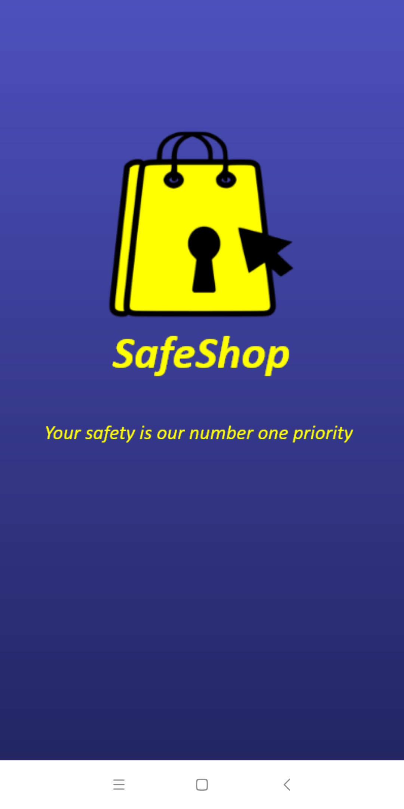
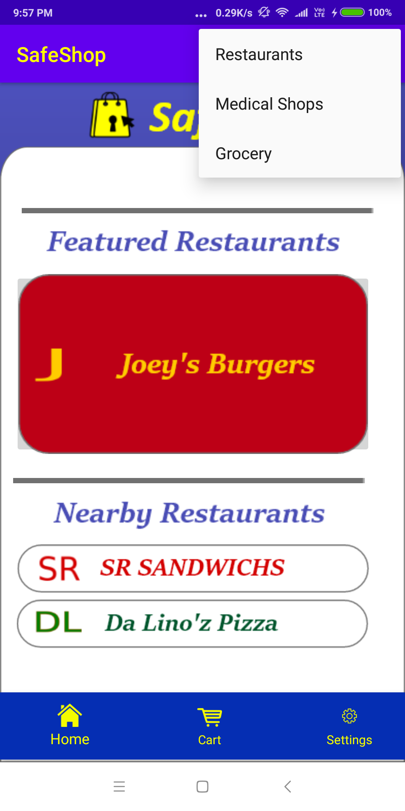
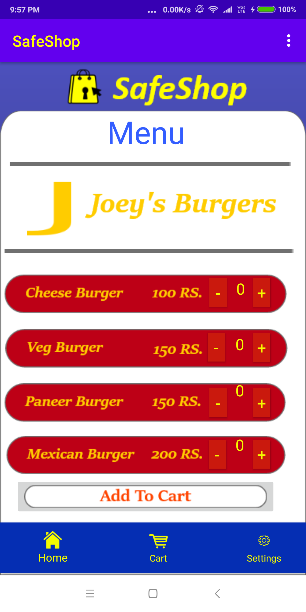
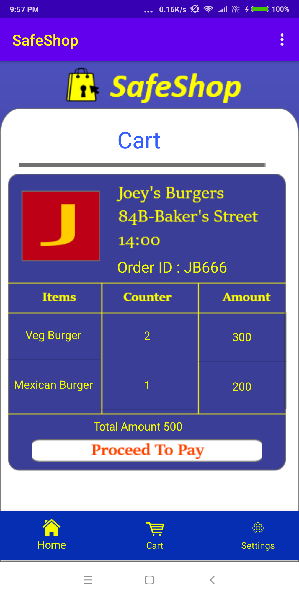

# SafeShop_App
### Repository for Main App

#### Overview:

1. The goal is to reduce the exposure to the virus by converting physical waiting lines to digital waiting lines.
2. People will be able to use his app to order the necessary items from home and they will be allocated a pick-up time slot, later they can go and pick up the order safely at the given time.
3. Currently, the app can be utilised by restaurants. We plan on adding functionality for various other businesses such as medical stores, grocery stores.

#### Features currently implemented:

1. Login Activity
2. Home Page view with a variety of restaurant options
3. Menu page of one restaurant in which you could choose the number of your favorite dishes and add them to the cart.
4. Cart page from which you could review your order and place it.

#### Future Implementation:

1. Integrating IBM services to app.
2. Adding options like Medical shops and groceries in addition to restaurants.
3. Integrating social distancing algorithm and feature designed by us in app.

#### Steps for Building:

1. Used IBM service of "App ID" for login activity and authentication.
2. Design pages and layout in AdobeXD.
3. Install Java JDK and Android Studio.
4. Implement flash screen.
5. Implement Home Page, Cart Page, Menu Page, and Payment Successful page using Fragments.

#### Images:

  
   
  Start Screen

  
   
  Home Screen

  
   
  Menu Screen

  
   
  Cart Screen

